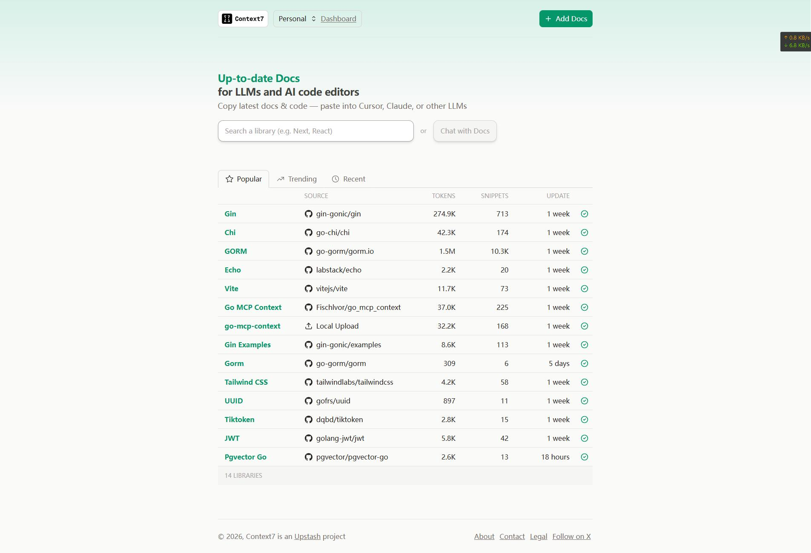
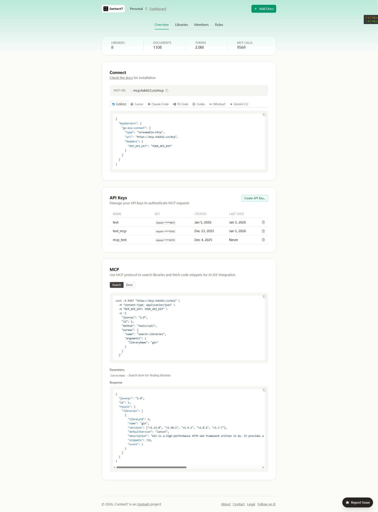

# go-mcp-context

<div align="center">


私有化的 Context7 替代方案，为企业内网的 AI IDE 提供实时、准确的技术文档和代码示例

🌐 **在线体验**: [https://mcp.hsk423.cn](https://mcp.hsk423.cn)



</div>

---

## 📖 项目介绍

go-mcp-context 是一个私有化的文档检索服务，通过 MCP 协议为 AI IDE（如 Cursor、Windsurf、VSCode）提供企业内部技术文档的智能检索能力。

### ✨ 核心特性

- 🔌 **MCP 协议规范化** - 完全遵循 MCP 规范，与 Costrict 等客户端无缝兼容
  - 协议无关的处理架构，支持 HTTP、SSE、Streamable HTTP 多种传输协议
  - 统一的 MCP 请求处理器，支持所有 MCP 方法
  - 规范的响应格式包装，确保客户端正确解析
- 🔍 **向量检索** - 基于 PostgreSQL + pgvector 的高性能向量搜索
- 📄 **多格式文档** - 支持 Markdown、PDF、DOCX、Swagger 等格式
- 🔀 **混合搜索** - 向量相似度 + BM25 关键词搜索
- 📊 **智能重排序** - 多指标评分优化搜索结果
- 🔐 **双重认证** - SSO JWT 管理 + API Key MCP 调用
- 🎨 **现代化 UI** - Vue3 + TypeScript + TailwindCSS
- 📦 **版本管理** - 支持库的多个版本，LLM 工作流指导

---

## 🚀 快速开始

### 前置条件

- Go 1.23+
- Node.js 22.15.0+
- Docker & Docker Compose
- PostgreSQL 15+ (with pgvector)
- Redis 6+
- OpenAI API Key

### 本地开发

```bash
# 克隆项目
git clone https://github.com/Fischlvor/go_mcp_context.git
cd go-mcp-context

# 运行后端
cd server-mcp
go run main.go

# 运行前端（新终端）
cd web-mcp
nvm use 22.15.0
npm install
npm run dev
```

### 生产部署

```bash
# 使用部署脚本
./deploy.sh all
```

详情见：[部署指南](docs/DEPLOYMENT.md)

---

## 🔧 IDE 配置

支持 Cursor、Windsurf、VSCode、Claude Code 等 IDE 和 CoStrict 插件。

配置示例和 API Key 获取：[https://mcp.hsk423.cn/dashboard](https://mcp.hsk423.cn/dashboard)



---

## 📚 文档

### 设计与规划

- [项目规划](需求整理和项目规划.md) - 需求整理、技术选型、数据库设计

### 架构设计

- [架构文档](docs/ARCHITECTURE.md) - 技术栈、项目结构、数据模型
- [搜索架构](docs/SEARCH.md) - 混合搜索、RRF 算法、性能优化
- [缓存架构](docs/CACHE.md) - 多层缓存、Redis 集成、缓存策略

### API 与接口

- [API 文档](docs/API.md) - REST API 接口说明
- [Swagger API 文档](http://localhost:8090/swagger/index.html) - 交互式 API 文档（需启动后端服务）
- [MCP 接口文档](docs/MCP.md) - MCP 协议实现和工具定义

### 部署与运维

- [部署指南](docs/DEPLOYMENT.md) - 环境配置、Docker 部署、Nginx 配置
- [开发日志](docs/CHANGELOG.md) - 版本更新记录

### 测试与验证

- [单元测试文档](server-mcp/test/README.md) - 单元测试、集成测试、覆盖率报告（81.0%）
- [CoStrict 效果验证](docs/effect/CoStrict效果测试验证方案.md) - MCP 集成效果测试方案
- [性能测试报告](docs/performance/PERFORMANCE_REPORT.md) - 文档更新性能、检索性能、MCP 函数调用性能分析

---

## 📄 License

[MIT](LICENSE)
