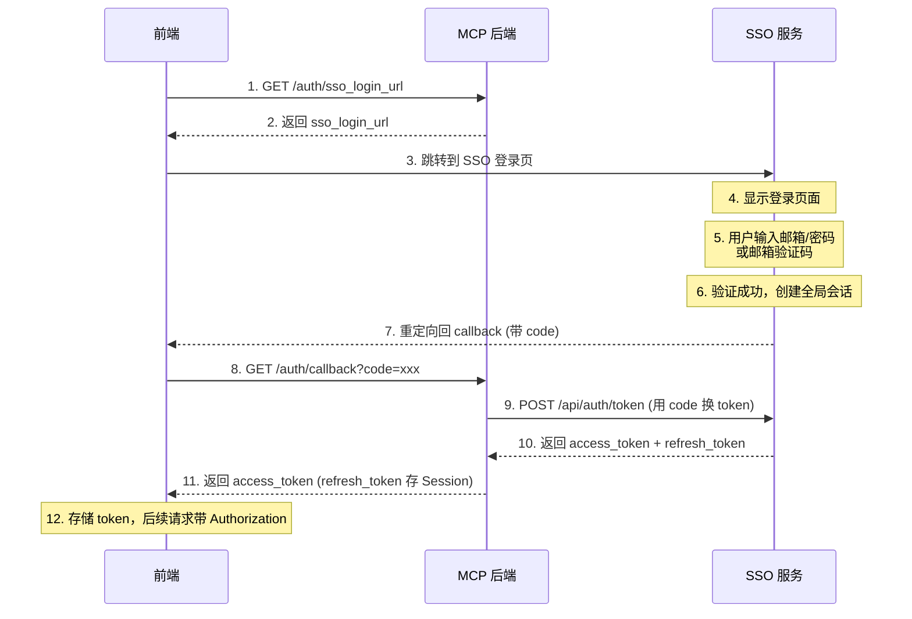
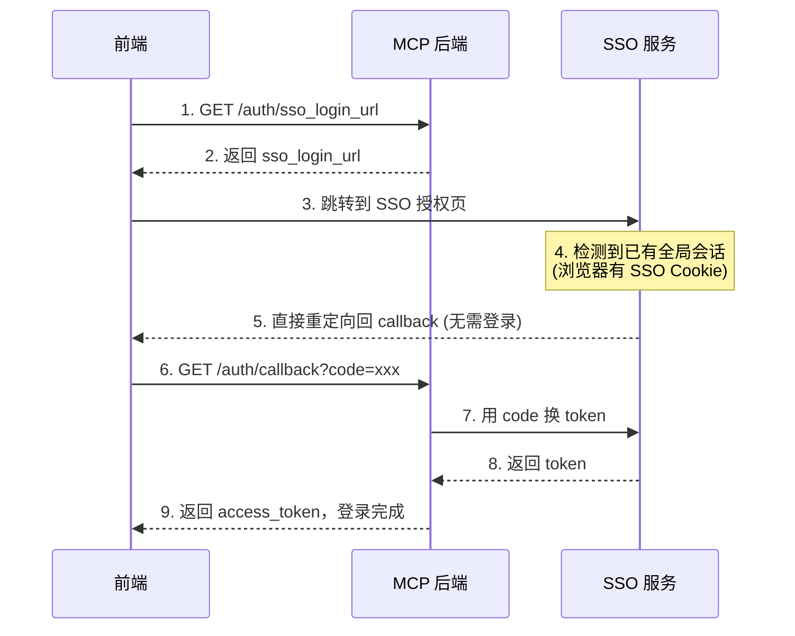
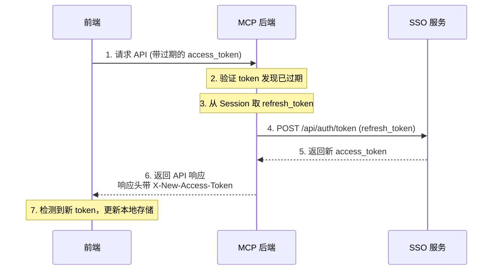

# API 文档

## 通用说明

- **Base URL**: `http://localhost:8090` 或 `https://mcp.hsk423.cn`
- **认证方式**:
  - REST API（私有接口）: `Authorization: Bearer <SSO_JWT_TOKEN>`
  - MCP 接口: `Authorization: Bearer <API_KEY>`
- **响应格式**: JSON

### 通用响应结构

**成功响应：**

```json
{
  "code": 0,
  "msg": "success",
  "data": { ... }
}
```

**错误响应：**

```json
{
  "code": 7,
  "msg": "错误信息"
}
```

### 分页响应

```json
{
  "code": 0,
  "data": {
    "list": [...],
    "total": 100,
    "page": 1,
    "page_size": 10
  }
}
```

---

## 认证接口

### SSO 登录流程（首次登录）



### SSO 静默登录流程（已有全局会话）

当用户已在 SSO 登录过（浏览器有 SSO Cookie），再次访问本应用时无需输入密码：



> 💡 整个过程用户只会看到页面短暂跳转，无需输入用户名密码。

---

### Token 静默刷新流程

当 access_token 过期时，后端中间件自动使用 Session 中的 refresh_token 刷新：



**响应头说明：**

| Header | 说明 |
|--------|------|
| X-New-Access-Token | 刷新后的新 access_token |
| X-Token-Expires-In | 新 token 的过期时间（秒） |

> 💡 前端需要在 Axios 拦截器中检测这些响应头，自动更新本地存储的 token。

---

### 获取 SSO 登录 URL

获取 SSO 单点登录跳转地址。

```http
GET /api/v1/auth/sso_login_url?redirect_uri=xxx&return_url=xxx
```

**Query 参数：**

| 参数 | 类型 | 必填 | 说明 |
|------|------|------|------|
| redirect_uri | string | 否 | 回调地址，默认使用配置的 CallbackURL |
| return_url | string | 否 | 登录成功后跳转的页面，默认 `/` |

**响应：**

```json
{
  "code": 0,
  "data": {
    "sso_login_url": "https://sso.hsk423.cn/api/oauth/authorize?app_id=xxx&redirect_uri=xxx&state=xxx"
  }
}
```

---

### SSO 回调

SSO 登录成功后的回调接口，用 code 换取 token。

```http
GET /api/v1/auth/callback?code=xxx&redirect_uri=xxx&state=xxx
```

**Query 参数：**

| 参数 | 类型 | 必填 | 说明 |
|------|------|------|------|
| code | string | 是 | SSO 返回的授权码 |
| redirect_uri | string | 否 | 回调地址（需与获取 code 时一致） |
| state | string | 否 | 状态参数（包含 return_url） |

**响应：**

```json
{
  "code": 0,
  "data": {
    "access_token": "eyJhbGciOiJSUzI1NiIsInR5cCI6IkpXVCJ9...",
    "token_type": "Bearer",
    "expires_in": 3600,
    "state": "{\"return_url\":\"/dashboard\"}"
  }
}
```

> 💡 `refresh_token` 存储在后端 Session 中，不返回给前端。Token 过期时后端自动刷新。

---

### 登出

```http
POST /api/v1/auth/logout
```

**响应：**

```json
{
  "code": 0,
  "msg": "success"
}
```

---

## 用户接口

### 获取用户信息

🔒 需要 SSO JWT 认证

```http
GET /api/v1/user/info
```

**响应：**

```json
{
  "code": 0,
  "data": {
    "uuid": "550e8400-e29b-41d4-a716-446655440000",
    "username": "zhangsan",
    "nickname": "张三",
    "email": "zhangsan@example.com",
    "avatar": "https://..."
  }
}
```

---

## 库管理接口

### 获取库列表

```http
GET /api/v1/libraries
```

**Query 参数：**

| 参数 | 类型 | 必填 | 说明 |
|------|------|------|------|
| name | string | 否 | 按名称搜索（支持语义向量搜索，如 "web framework" 可匹配 "Gin"、"Echo" 等） |
| sort | string | 否 | `popular`（按热度）或 `recent`（按时间，默认） |
| page | int | 否 | 页码，默认 1 |
| page_size | int | 否 | 每页数量，默认 10 |

**搜索策略：**
- 优先使用语义向量搜索（基于 cosine distance）
- 向量搜索失败或无结果时，降级到 SQL LIKE 模糊匹配

**响应：**

```json
{
  "code": 0,
  "data": {
    "list": [
      {
        "id": 1,
        "name": "gin",
        "source_type": "github",
        "source_url": "gin-gonic/gin",
        "default_version": "latest",
        "token_count": 125000,
        "chunk_count": 450,
        "updated_at": "2025-12-24T10:00:00Z"
      }
    ],
    "total": 50,
    "page": 1,
    "page_size": 10
  }
}
```

---

### 获取库详情

```http
GET /api/v1/libraries/:id
```

**响应：**

```json
{
  "code": 0,
  "data": {
    "id": 1,
    "name": "gin",
    "default_version": "latest",
    "versions": ["v1.9.0", "v1.8.0"],
    "source_type": "github",
    "source_url": "gin-gonic/gin",
    "description": "Gin is a HTTP web framework written in Go",
    "document_count": 25,
    "chunk_count": 450,
    "token_count": 125000,
    "status": "active",
    "created_at": "2025-12-01T10:00:00Z",
    "updated_at": "2025-12-24T10:00:00Z"
  }
}
```

---

### 获取版本列表

```http
GET /api/v1/libraries/:id/versions
```

**响应：**

```json
{
  "code": 0,
  "data": [
    {
      "version": "latest",
      "token_count": 80000,
      "chunk_count": 300,
      "last_updated": "2025-12-24T10:00:00Z"
    },
    {
      "version": "v1.9.0",
      "token_count": 45000,
      "chunk_count": 150,
      "last_updated": "2025-12-20T10:00:00Z"
    }
  ]
}
```

---

### 创建库

🔒 需要 SSO JWT 认证

```http
POST /api/v1/libraries
```

**请求体：**

```json
{
  "name": "my-docs",
  "description": "My documentation library"
}
```

| 字段 | 类型 | 必填 | 说明 |
|------|------|------|------|
| name | string | 是 | 库名称 |
| description | string | 否 | 描述 |

> 此接口仅用于创建 Local 类型库。GitHub 类型请使用 [从 GitHub URL 快速导入](#从-github-url-快速导入) 接口。

**响应：**

```json
{
  "code": 0,
  "data": {
    "id": 1
  }
}
```

---

### 更新库

🔒 需要 SSO JWT 认证

```http
PUT /api/v1/libraries/:id
```

**请求体：**

```json
{
  "name": "gin",
  "description": "Updated description"
}
```

| 字段 | 类型 | 必填 | 说明 |
|------|------|------|------|
| name | string | 是 | 库名称 |
| description | string | 否 | 描述 |

> 注意：`source_type` 和 `source_url` 创建后不可修改。

---

### 删除库

🔒 需要 SSO JWT 认证

```http
DELETE /api/v1/libraries/:id
```

---

### 创建版本

🔒 需要 SSO JWT 认证

```http
POST /api/v1/libraries/:id/versions
```

**请求体：**

```json
{
  "version": "v1.10.0"
}
```

---

### 删除版本

🔒 需要 SSO JWT 认证

```http
DELETE /api/v1/libraries/:id/versions/:version
```

---

### 刷新版本

🔒 需要 SSO JWT 认证

重新处理该版本下的所有文档（重新分块、生成 Embedding）。

```http
POST /api/v1/libraries/:id/versions/:version/refresh
```

---

## GitHub 导入接口

### 获取 GitHub 仓库版本列表

🔒 需要 SSO JWT 认证

```http
GET /api/v1/libraries/github/releases?repo=gin-gonic/gin
```

**Query 参数：**

| 参数 | 类型 | 必填 | 说明 |
|------|------|------|------|
| repo | string | 是 | GitHub 仓库，格式 `owner/repo` |
| max_count | int | 否 | 最多返回版本数，默认 20 |

**响应：**

```json
{
  "code": 0,
  "data": {
    "repo": "gin-gonic/gin",
    "default_branch": "master",
    "description": "Gin is a HTTP web framework written in Go",
    "versions": ["v1.9.1", "v1.9.0", "v1.8.2"]
  }
}
```

---

### 从 GitHub URL 快速导入

🔒 需要 SSO JWT 认证

自动解析 GitHub URL，创建库并导入文档。

```http
POST /api/v1/libraries/github/init-import
```

**请求体：**

```json
{
  "github_url": "https://github.com/gin-gonic/gin"
}
```

**响应：**

```json
{
  "code": 0,
  "data": {
    "library_id": 1,
    "version": "latest"
  }
}
```

---

### 从 GitHub 导入文档

🔒 需要 SSO JWT 认证

向已有库导入 GitHub 文档。

```http
POST /api/v1/libraries/github/import?id=1
```

**请求体：**

```json
{
  "repo": "gin-gonic/gin",
  "branch": "master",
  "tag": "",
  "version": "latest",
  "path_filter": "docs/",
  "excludes": ["*_test.md"]
}
```

| 字段 | 类型 | 必填 | 说明 |
|------|------|------|------|
| repo | string | 是 | GitHub 仓库 `owner/repo` |
| branch | string | 否 | 分支名（与 tag 二选一） |
| tag | string | 否 | 标签名 |
| version | string | 否 | 存储为的版本名 |
| path_filter | string | 否 | 只导入指定路径 |
| excludes | []string | 否 | 排除模式 |

---

## 文档管理接口

### 获取文档列表

```http
GET /api/v1/documents/list
```

**Query 参数：**

| 参数 | 类型 | 必填 | 说明 |
|------|------|------|------|
| library_id | uint | 是 | 库 ID |
| version | string | 否 | 版本过滤 |
| page | int | 否 | 页码 |
| page_size | int | 否 | 每页数量 |

**响应：**

```json
{
  "code": 0,
  "data": {
    "list": [
      {
        "id": 1,
        "title": "Getting Started",
        "file_type": "markdown",
        "token_count": 1500,
        "chunk_count": 5,
        "updated_at": "2025-12-24T10:00:00Z"
      }
    ],
    "total": 25,
    "page": 1,
    "page_size": 10
  }
}
```

---

### 获取文档详情

```http
GET /api/v1/documents/detail/:id
```

---

### 获取文档块

获取库的文档块（用于 MCP 返回给 AI）。

```http
GET /api/v1/documents/chunks/:mode/:libid?version=xxx&topic=xxx
```

**Path 参数：**

| 参数 | 类型 | 说明 |
|------|------|------|
| mode | string | `code` 或 `info` |
| libid | uint | 库 ID |

**Query 参数：**

| 参数 | 类型 | 必填 | 说明 |
|------|------|------|------|
| version | string | 否 | 版本，默认使用 defaultVersion |
| topic | string | 否 | 搜索主题（触发向量搜索） |
| page | int | 否 | 分页 |

---

### 上传文档

🔒 需要 SSO JWT 认证

```http
POST /api/v1/documents/upload
Content-Type: multipart/form-data
```

**Form 参数：**

| 参数 | 类型 | 必填 | 说明 |
|------|------|------|------|
| library_id | uint | 是 | 库 ID |
| version | string | 否 | 版本，默认 `latest` |
| file | file | 是 | 文档文件（.md） |

---

### 删除文档

🔒 需要 SSO JWT 认证

```http
DELETE /api/v1/documents/:id
```

---

## API Key 管理接口

### 创建 API Key

🔒 需要 SSO JWT 认证

```http
POST /api/v1/api-keys/create
```

**请求体：**

```json
{
  "name": "My IDE Key"
}
```

**响应：**

```json
{
  "code": 0,
  "data": {
    "id": 1,
    "name": "My IDE Key",
    "api_key": "mcp_xxxxxxxxxxxxxxxxxxxx",
    "token_suffix": "xxxx",
    "created_at": "2025-12-24T10:00:00Z"
  }
}
```

> ⚠️ `api_key` 仅在创建时返回一次，请妥善保存。

---

### 获取 API Key 列表

🔒 需要 SSO JWT 认证

```http
GET /api/v1/api-keys/list
```

**响应：**

```json
{
  "code": 0,
  "data": [
    {
      "id": 1,
      "name": "My IDE Key",
      "token_suffix": "xxxx",
      "last_used_at": "2025-12-24T10:00:00Z",
      "created_at": "2025-12-24T10:00:00Z"
    }
  ]
}
```

---

### 删除 API Key

🔒 需要 SSO JWT 认证

```http
DELETE /api/v1/api-keys/:id
```

---

## 统计接口

### 获取个人统计

🔒 需要 SSO JWT 认证

```http
GET /api/v1/stats/my
```

**响应：**

```json
{
  "code": 0,
  "data": {
    "libraries": 5,
    "documents": 120,
    "tokens": 500000,
    "mcp_calls": 1500
  }
}
```

---

## 活动日志接口

### 获取活动日志

```http
GET /api/v1/logs?library_id=1
```

**Query 参数：**

| 参数 | 类型 | 必填 | 说明 |
|------|------|------|------|
| library_id | uint | 是 | 库 ID |
| task_id | string | 否 | 任务 ID（过滤特定任务） |

**响应：**

```json
{
  "code": 0,
  "data": {
    "logs": [
      {
        "id": 1,
        "event": "github.import.complete",
        "status": "success",
        "message": "导入完成，共 25 个文档",
        "created_at": "2025-12-24T10:00:00Z"
      }
    ],
    "status": "complete"
  }
}
```

---

## MCP 接口

MCP 接口已独立为单独文档，详见 [MCP 接口文档](./MCP.md)。
