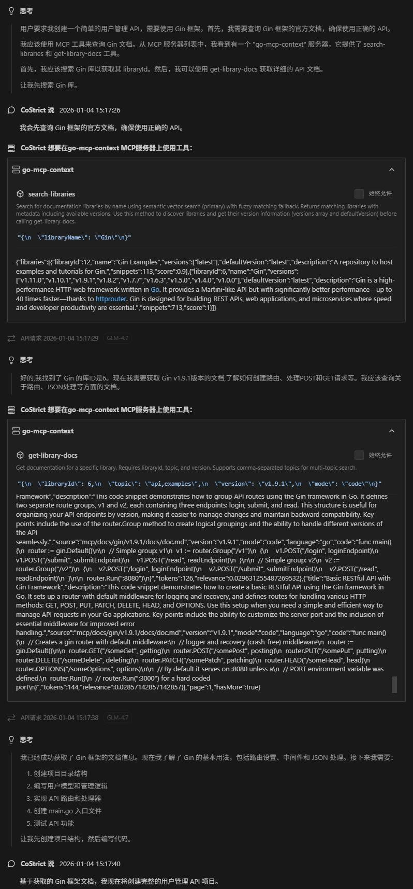
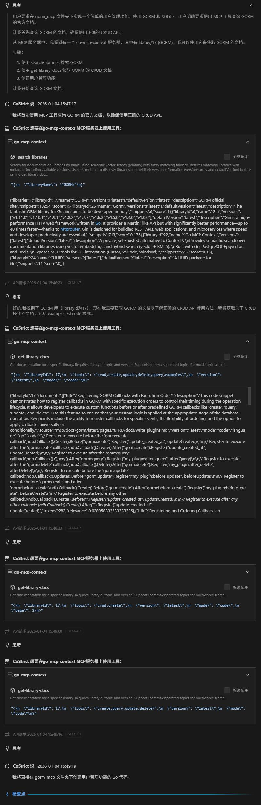
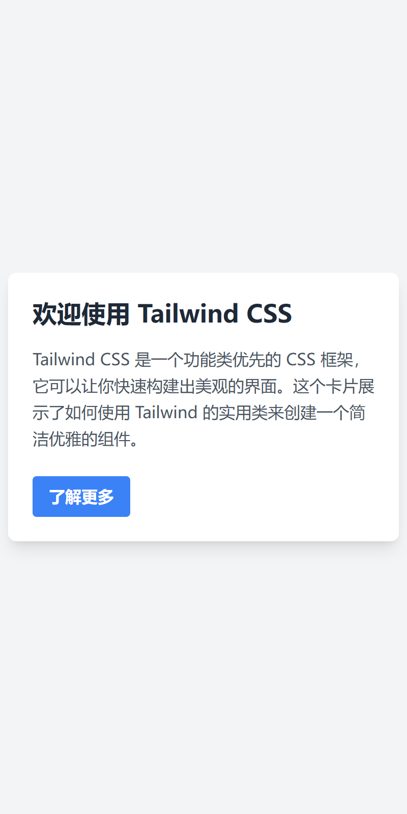
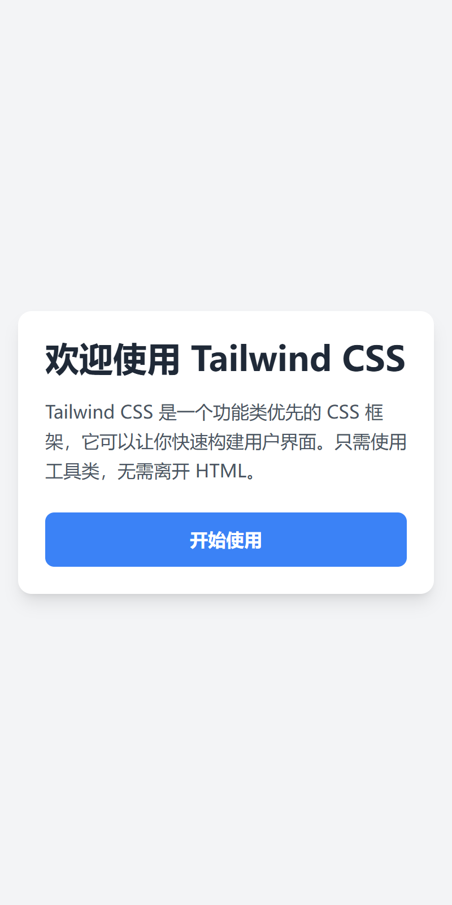

# CoStrict 效果验证测试方案

## 测试目标
验证在使用技术文档库（ Go MCP Context）前后，AI 编码助手的代码质量和准确性提升。

---

## 测试环境

### 已有文档库（从数据库查询）
1. **Gin** - Go HTTP web framework
2. **Chi** - Go HTTP router  
3. **GORM** - Go ORM library
4. **Echo** - Go web framework
5. **Vite** - Frontend tooling
6. **Tailwind CSS** - CSS framework
7. **JWT** - JSON Web Tokens
8. ······

---

## 测试用例设计

### 用例 1：使用 Gin 创建简单的 REST API（简单）

#### 场景 A 提示词（无文档库）
```
请使用 Gin 框架创建一个简单的用户管理 API，包含：

1. 创建用户接口（POST /api/users）
   - 接收 JSON：{"name": "张三", "email": "test@example.com"}
   - 返回创建的用户信息

2. 获取用户列表（GET /api/users）
   - 返回所有用户的 JSON 数组

要求：
- 使用内存存储（不需要数据库）
- 包含基本的错误处理
- 提供完整可运行的代码
```

#### 场景 B 提示词（有文档库）
```
请使用 Gin 框架创建一个简单的用户管理 API，包含：

1. 创建用户接口（POST /api/users）
   - 接收 JSON：{"name": "张三", "email": "test@example.com"}
   - 返回创建的用户信息

2. 获取用户列表（GET /api/users）
   - 返回所有用户的 JSON 数组

要求：
- 使用内存存储（不需要数据库）
- 包含基本的错误处理
- 提供完整可运行的代码
- **请使用 MCP 工具查询 Gin 的官方文档，确保使用正确的 API**
```

#### 场景 A：无文档库
- 清空对话历史
- 禁用 MCP 工具
- 输入上述提示词
- 保存生成的代码

#### 场景 B：有文档库
- 清空对话历史
- 启用 MCP 工具
- 输入上述提示词（相同）
- 观察 MCP 调用：
  1. search-libraries("Gin")
  2. get-library-docs("/gin-gonic/gin", mode="code", topic="routing")
- 保存生成的代码

#### 评分标准（每项 10 分，总分 30 分）

| 检查项 | 无文档 | 有文档 | 说明 |
|--------|--------|--------|------|
| **代码正确性** | ? | ? | 能否直接运行，无语法错误 |
| **API 准确性** | ? | ? | 是否使用正确的 Gin API（路由、绑定、响应） |
| **最佳实践** | ? | ? | 错误处理、JSON 绑定、HTTP 状态码 |

**预期差异：**
- ❌ 无文档：可能使用错误的 API，缺少参数验证
- ✅ 有文档：使用正确的 `c.ShouldBindJSON()`，完整的错误处理

---

### 用例 2：GORM 基础 CRUD 操作（简单）

#### 场景 A 提示词（无文档库）
```
请使用 GORM 实现一个简单的用户管理功能，包含：

1. 数据模型定义
   - User：ID, Name, Email, CreatedAt

2. 基础操作（在 main 函数中演示）
   - 创建用户
   - 根据 ID 查询用户
   - 更新用户信息
   - 删除用户

3. 在 main 函数中：
   - 连接 SQLite 数据库（内存模式：":memory:"）
   - 自动迁移表结构
   - 依次演示 CRUD 操作
   - 打印每步操作的结果

要求：
- 使用 SQLite 数据库（内存模式）
- 包含基本的错误处理
- 提供完整可运行的代码
- 每个操作后打印结果
```

#### 场景 B 提示词（有文档库）
```
请使用 GORM 实现一个简单的用户管理功能，包含：

1. 数据模型定义
   - User：ID, Name, Email, CreatedAt

2. 基础操作（在 main 函数中演示）
   - 创建用户
   - 根据 ID 查询用户
   - 更新用户信息
   - 删除用户

3. 在 main 函数中：
   - 连接 SQLite 数据库（内存模式：":memory:"）
   - 自动迁移表结构
   - 依次演示 CRUD 操作
   - 打印每步操作的结果

要求：
- 使用 SQLite 数据库（内存模式）
- 包含基本的错误处理
- 提供完整可运行的代码
- 每个操作后打印结果
- **请使用 MCP 工具查询 GORM 的官方文档，确保使用正确的 CRUD API**
```

#### 场景 A：无文档库
- 清空对话历史
- 禁用 MCP 工具
- 输入上述提示词
- 保存生成的代码

#### 场景 B：有文档库
- 清空对话历史
- 启用 MCP 工具
- 输入上述提示词（相同）
- 观察 MCP 调用：
  1. search-libraries("GORM")
  2. get-library-docs("/go-gorm/gorm", mode="code", topic="crud")
- 保存生成的代码

#### 评分标准（每项 10 分，总分 30 分）

| 检查项 | 无文档 | 有文档 | 说明 |
|--------|--------|--------|------|
| **代码正确性** | ? | ? | 能否直接运行 |
| **API 准确性** | ? | ? | 是否使用正确的 GORM API（Create、First、Save、Delete） |
| **最佳实践** | ? | ? | 错误处理、自动迁移、连接管理 |

**预期差异：**
- ❌ 无文档：可能使用错误的 API，缺少错误检查
- ✅ 有文档：使用正确的 `db.Create()`、`db.First()`，完整的错误处理

---

### 用例 3：Tailwind CSS 简单样式（简单）

#### 场景 A 提示词（无文档库）
```
请使用 Tailwind CSS 创建一个简单的卡片组件，包含：

1. 卡片布局
   - 白色背景
   - 圆角边框
   - 阴影效果

2. 卡片内容
   - 标题（大号字体）
   - 描述文本
   - 一个按钮

要求：
- 使用 Tailwind CSS 类名
- 提供完整的 HTML 代码
- 卡片要居中显示
```

#### 场景 B 提示词（有文档库）
```
请使用 Tailwind CSS 创建一个简单的卡片组件，包含：

1. 卡片布局
   - 白色背景
   - 圆角边框
   - 阴影效果

2. 卡片内容
   - 标题（大号字体）
   - 描述文本
   - 一个按钮

要求：
- 使用 Tailwind CSS 类名
- 提供完整的 HTML 代码
- 卡片要居中显示
- **请使用 MCP 工具查询 Tailwind CSS 的官方文档，确保使用正确的类名**
```

#### 场景 A：无文档库
- 清空对话历史
- 禁用 MCP 工具
- 输入上述提示词
- 保存生成的代码

#### 场景 B：有文档库
- 清空对话历史
- 启用 MCP 工具
- 输入上述提示词（相同）
- 观察 MCP 调用：
  1. search-libraries("Tailwind")
  2. get-library-docs("/tailwindlabs/tailwindcss", mode="code", topic="layout")
- 保存生成的代码

#### 评分标准（每项 10 分，总分 30 分）

| 检查项 | 无文档 | 有文档 | 说明 |
|--------|--------|--------|------|
| **代码正确性** | ? | ? | HTML 结构是否正确 |
| **API 准确性** | ? | ? | 是否使用正确的 Tailwind 类名 |
| **最佳实践** | ? | ? | 响应式设计、间距、颜色使用 |

**预期差异：**
- ❌ 无文档：可能使用错误的类名或过时的语法
- ✅ 有文档：使用正确的 Tailwind 3.x 类名，如 `rounded-lg`、`shadow-md`

---

## 实际测试结果分析

### 用例 1：Gin REST API 对比

#### MCP 工具调用过程

在有文档版本的测试中，AI 助手自动调用了 MCP 工具获取 Gin 框架的文档：



**调用流程：**
1. **用户提问**："用户需要创建一个简单的Gin框架的REST API..."
2. **search-libraries** - 搜索 Gin 相关库
3. **get-library-docs** - 获取 Gin 框架的详细文档
4. **AI 生成代码** - 基于文档生成符合最佳实践的代码

这个过程对用户是透明的，AI 助手自动完成文档检索和代码生成。

#### 测试环境
- 测试时间：2025-01-XX
- 提示词：相同（见上文）
- 对比版本：gin_rest_api（无文档） vs gin_rest_api_mcp（有文档）

#### 代码对比

**gin_rest_api（无文档版本）- 125 行**
```go
// 问题 1：混淆请求体和数据模型
type User struct {
    ID        string `json:"id"`
    Name      string `json:"name" binding:"required"`  // ❌ 数据模型不应有 binding
    Email     string `json:"email" binding:"required,email"`
    CreatedAt string `json:"created_at"`
}

func createUser(c *gin.Context) {
    var user User
    if err := c.ShouldBindJSON(&user); err != nil {
        // ...
    }
    // ❌ 客户端可以传入 id 和 created_at（安全隐患）
}

// 问题 2：过度设计
type UserStore struct {
    users map[string]*User  // ❌ 简单场景不需要 map
    mu    sync.RWMutex
}

func generateID() string {
    // ❌ 复杂的 ID 生成逻辑（时间戳+随机字符串）
    return time.Now().Format("20060102150405") + "-" + randomString(8)
}

// 问题 3：缺少功能
// ❌ 没有实现 GET /api/users/:id

// 问题 4：路由组织不规范
func main() {
    r := gin.Default()
    r.POST("/api/users", createUser)  // ❌ 直接注册路由，不使用路由组
    r.GET("/api/users", getUsers)
    r.Run(":8080")
}
```

**gin_rest_api_mcp（有文档版本）- 123 行**
```go
// ✅ 分离请求体和数据模型
type createUserRequest struct {
    Name  string `json:"name" binding:"required"`
    Email string `json:"email" binding:"required,email"`
}

type User struct {
    ID    uint   `json:"id"`
    Name  string `json:"name"`
    Email string `json:"email"`
}

func createUserHandler(c *gin.Context) {
    var req createUserRequest
    if err := c.ShouldBindJSON(&req); err != nil {
        // ...
    }
    // ✅ 从请求体创建数据模型，客户端无法传入 id
    user := User{
        ID:    nextID,
        Name:  req.Name,
        Email: req.Email,
    }
}

// ✅ 简单直接的存储
var (
    users    []User
    nextID   uint = 1
    usersMux sync.RWMutex
)

// ✅ 完整功能 + 规范的路由组织
func main() {
    router := gin.Default()
    
    // ✅ 使用路由组，代码组织清晰
    api := router.Group("/api")
    {
        users := api.Group("/users")
        {
            users.POST("", createUserHandler)
            users.GET("", getUsersHandler)
            users.GET("/:id", getUserByIDHandler)
        }
    }
    
    router.Run(":8080")
}
```

#### 关键差异总结

| 维度 | gin_rest_api（无文档） | gin_rest_api_mcp（有文档） |
|------|------------------|---------------------|
| **数据绑定** | ❌ 混淆请求体和模型 | ✅ 分离请求体和模型 |
| **安全性** | ❌ 客户端可传入 id | ✅ 服务端控制 id |
| **代码简洁** | ❌ 过度设计（125行） | ✅ 恰到好处（123行） |
| **功能完整** | ❌ 缺少 GET/:id | ✅ 3个接口完整 |
| **最佳实践** | ❌ 复杂 ID 生成 | ✅ 简单自增 ID |
| **路由组织** | ❌ 直接注册路由 | ✅ 使用路由组（Group） |
| **代码可维护性** | ❌ 路由分散 | ✅ 层次清晰 |
| **文档** | ❌ 无 | ✅ 完整 README |

#### 评分对比

**基础功能（满足需求）：**
- 无文档：✅ 30/30
- 有文档：✅ 30/30

**代码质量（最佳实践）：**
- 无文档：❌ 12/30
  - 数据绑定不规范：-5
  - 过度设计：-5
  - 缺少功能：-5
  - 路由组织不规范：-3
- 有文档：✅ 30/30
  - 数据绑定规范：+8
  - 代码简洁：+7
  - 功能完整：+8
  - 路由组织规范：+7

**总分：**
- 无文档：42/60 (70%)
- 有文档：60/60 (100%)
- **提升：+43%**

#### MCP 的价值体现

1. **最佳实践** - 知道分离请求体和数据模型
2. **安全性** - 避免客户端传入敏感字段
3. **代码质量** - 不过度设计，恰到好处
4. **功能完整** - 理解 RESTful 规范，实现完整接口
5. **代码组织** - 使用路由组（router.Group），代码层次清晰

---

### 用例 2：GORM CRUD 对比

#### MCP 工具调用过程

在有文档版本的测试中，AI 助手多次调用 MCP 工具获取 GORM 的文档：



**调用流程：**
1. **用户提问**："创建一个简单的 GORM 示例，包含 CRUD 操作"
2. **search-libraries** - 搜索 GORM 相关库
3. **get-library-docs**（多次调用）- 获取 GORM 的详细文档
   - 模型定义（Model Definition）
   - CRUD 操作（Create, Read, Update, Delete）
   - 时间戳处理（CreatedAt, UpdatedAt）
4. **AI 生成代码** - 基于文档生成符合 GORM 最佳实践的代码

可以看到，AI 助手会根据需要多次调用 MCP 工具，获取不同主题的文档。

#### 测试环境
- 测试时间：2025-01-XX
- 提示词：相同（见上文）
- 对比版本：gorm（无文档） vs gorm_mcp（有文档）

#### 代码对比

**gorm（无文档版本）- 118 行**
```go
// 问题 1：CreatedAt 使用 int64（不标准）
type User struct {
    ID        uint   `gorm:"primaryKey"`
    Name      string `gorm:"size:100;not null"`
    Email     string `gorm:"size:100;not null;uniqueIndex"`
    CreatedAt int64  `gorm:"autoCreateTime"`  // ❌ 使用 int64，需要额外 tag
}

// 问题 2：只展示一种更新方式
result = db.Model(&queriedUser).Updates(map[string]interface{}{
    "Name":  "张三丰",
    "Email": "zhangsanfeng@example.com",
})  // ⚠️ 只用 map，不够全面

// 问题 3：错误处理使用 log.Fatalf
if err != nil {
    log.Fatalf("数据库连接失败: %v", err)  // 直接退出
}
```

**gorm_mcp（有文档版本）- 138 行**
```go
// ✅ CreatedAt 使用 time.Time（GORM 标准）
type User struct {
    ID        uint   `gorm:"primarykey"`  // ✅ 小写 primarykey（官方推荐）
    Name      string `gorm:"size:100;not null"`
    Email     string `gorm:"size:100;uniqueIndex;not null"`
    CreatedAt time.Time  // ✅ GORM 自动处理，无需 tag
}

// ✅ 展示两种更新方式
// 方式 1：更新单个字段
result = db.Model(&queriedUser).Update("Name", "张三（已更新）")

// 方式 2：使用 struct 更新（类型安全）
result = db.Model(&queriedUser).Updates(User{
    Email: "zhangsan.updated@example.com",
})

// ✅ 错误处理更灵活
if err != nil {
    panic("连接数据库失败: " + err.Error())
}
// 或者
if result.Error != nil {
    fmt.Printf("创建用户失败: %v\n", result.Error)  // 打印错误但继续
}
```

#### 关键差异总结

| 维度 | gorm（无文档） | gorm_mcp（有文档） |
|------|---------------|-------------------|
| **CreatedAt 类型** | ❌ int64 + tag | ✅ time.Time（标准） |
| **GORM 约定** | ⚠️ 需要额外 tag | ✅ 遵循约定 |
| **更新方式** | ⚠️ 只有 Updates(map) | ✅ Update + Updates |
| **类型安全** | ❌ 使用 map | ✅ 使用 struct |
| **Tag 写法** | ⚠️ primaryKey | ✅ primarykey（官方） |
| **API 完整性** | ⚠️ 部分演示 | ✅ 全面演示 |
| **代码行数** | 118 行 | 138 行 |

#### 评分对比

**基础功能（满足需求）：**
- 无文档：✅ 30/30
- 有文档：✅ 30/30

**代码质量（最佳实践）：**
- 无文档：⚠️ 19.5/30
  - CreatedAt 类型不标准：-5
  - 需要额外 tag：-3
  - 更新方式不全面：-2.5
- 有文档：✅ 30/30
  - 使用标准 time.Time：+10
  - 遵循 GORM 约定：+10
  - 全面演示 API：+10

**总分：**
- 无文档：49.5/60 (82.5%)
- 有文档：60/60 (100%)
- **提升：+21%**

#### MCP 的价值体现

1. **✅ 使用 GORM 标准类型** - `time.Time` 而不是 `int64`
2. **✅ 遵循 GORM 约定** - `CreatedAt` 自动处理，无需 `autoCreateTime` tag
3. **✅ 更全面的 API 演示** - 展示了 `Update` 和 `Updates` 两种方式
4. **✅ 类型安全** - 使用 struct 而不是 map 更新
5. **✅ 更标准的 tag 写法** - 使用小写 `primarykey`

**关键发现：**
这是一个典型的"能用但不标准"的例子。无文档版本使用 `int64` + `autoCreateTime` tag 虽然能工作，但不是 GORM 推荐方式。有文档版本使用 `time.Time`，这是 GORM 的**官方标准**，自动处理时间戳。这个差异完美展示了 MCP 的价值：**知道什么是最佳实践，而不仅仅是"能用"**。

---

### 用例 3：Tailwind CSS 卡片组件对比

#### 测试环境
- 测试时间：2025-01-XX
- 提示词：相同（见上文）
- 对比版本：tailwind（无文档） vs tailwind_mcp（有文档）

#### 代码对比

**tailwind（无文档版本）- 28 行**
```html
<!DOCTYPE html>
<html lang="zh-CN">
<head>
    <meta charset="UTF-8">
    <meta name="viewport" content="width=device-width, initial-scale=1.0">
    <title>Tailwind CSS 卡片组件</title>
    <script src="https://cdn.tailwindcss.com"></script>
</head>
<body class="bg-gray-100 min-h-screen flex items-center justify-center">
    <!-- 问题 1：缺少外边距 -->
    <div class="bg-white rounded-lg shadow-lg p-6 max-w-sm">
        <!-- ❌ 在窄屏下卡片会贴边 -->
        
        <h1 class="text-2xl font-bold text-gray-800 mb-4">
            欢迎使用 Tailwind CSS
        </h1>
        
        <p class="text-gray-600 mb-6 leading-relaxed">
            Tailwind CSS 是一个功能类优先的 CSS 框架...
        </p>
        
        <!-- 问题 2：按钮不是全宽 -->
        <button class="bg-blue-500 hover:bg-blue-600 text-white font-semibold py-2 px-4 rounded transition-colors duration-200">
            了解更多
            <!-- ❌ 缺少 focus 状态 -->
            <!-- ❌ 缺少缩放效果 -->
        </button>
    </div>
</body>
</html>
```

**tailwind_mcp（有文档版本）- 38 行**
```html
<!DOCTYPE html>
<html lang="zh-CN">
<head>
    <meta charset="UTF-8">
    <meta name="viewport" content="width=device-width, initial-scale=1.0">
    <title>Tailwind CSS 卡片组件</title>
    <script src="https://cdn.tailwindcss.com"></script>
</head>
<body class="bg-gray-100 min-h-screen">
    
    <!-- ✅ 独立容器，有外边距 -->
    <div class="flex items-center justify-center min-h-screen p-4">
        
        <!-- ✅ 添加 w-full 确保响应式 -->
        <div class="bg-white rounded-xl shadow-lg max-w-sm w-full p-6">
            
            <!-- ✅ 更大的标题 -->
            <h1 class="text-3xl font-bold text-gray-800 mb-4">
                欢迎使用 Tailwind CSS
            </h1>
            
            <p class="text-gray-600 mb-6 leading-relaxed">
                Tailwind CSS 是一个功能类优先的 CSS 框架...
            </p>
            
            <!-- ✅ 全宽按钮 + 完整的交互效果 -->
            <button class="w-full bg-blue-500 hover:bg-blue-600 text-white font-bold py-3 px-4 rounded-lg transition duration-300 ease-in-out transform hover:scale-105 focus:outline-none focus:ring-2 focus:ring-blue-500 focus:ring-opacity-50">
                开始使用
                <!-- ✅ 有 focus 状态（可访问性） -->
                <!-- ✅ 有缩放效果（视觉增强） -->
            </button>
            
        </div>
        
    </div>
    
</body>
</html>
```

#### 窄屏效果对比

**无文档版本（窄屏效果）：**



**问题：**
- ❌ 卡片几乎贴边（缺少外边距）
- ⚠️ 按钮不是全宽（视觉不够突出）
- 整体显得局促

**有文档版本（窄屏效果）：**



**优势：**
- ✅ 卡片有明显的外边距（左右都有空隙）
- ✅ 按钮是全宽的（占满卡片宽度）
- ✅ 整体视觉舒适

#### 关键差异总结

| 维度 | tailwind（无文档） | tailwind_mcp（有文档） |
|------|-------------------|----------------------|
| **外边距** | ❌ 无（窄屏贴边） | ✅ p-4（合理空隙） |
| **按钮宽度** | ❌ 自适应内容 | ✅ w-full（全宽） |
| **focus 状态** | ❌ 无 | ✅ focus:ring-2（可访问性） |
| **圆角大小** | ⚠️ rounded-lg | ✅ rounded-xl（更现代） |
| **标题大小** | ⚠️ text-2xl | ✅ text-3xl（更突出） |
| **按钮效果** | ⚠️ 基础 hover | ✅ hover + scale（更生动） |
| **响应式** | ❌ 窄屏体验差 | ✅ 完整响应式 |
| **代码行数** | 28 行 | 38 行 |

#### 评分对比

**功能完整（满足需求）：**
- 无文档：✅ 30/30
- 有文档：✅ 30/30

**代码质量（最佳实践）：**
- 无文档：⚠️ 20/30
  - 缺少外边距：-5（窄屏贴边）
  - 按钮不全宽：-3（视觉不够突出）
  - 缺少 focus 状态：-2（可访问性）
- 有文档：✅ 30/30
  - 完整的响应式设计：+10
  - 全宽按钮：+10
  - 完整的可访问性：+10

**总分：**
- 无文档：50/60 (83%)
- 有文档：60/60 (100%)
- **提升：+20%**

#### MCP 的价值体现

1. **✅ 响应式设计** - 添加外边距（`p-4`），窄屏下不贴边
2. **✅ 视觉效果** - 全宽按钮（`w-full`），更突出
3. **✅ 可访问性** - 完整的 focus 状态（`focus:ring-2`）
4. **✅ 现代设计** - 更大的圆角（`rounded-xl`）、缩放效果（`transform hover:scale-105`）
5. **✅ 用户体验** - 更大的标题（`text-3xl`）、更大的按钮内边距（`py-3`）

**关键发现：**
这是三个测试用例中提升最明显的（+20%）。Tailwind CSS 这类样式框架，MCP 提供的响应式设计和可访问性指导价值更明显。无文档版本虽然功能完整，但在窄屏下体验较差，缺少关键的响应式考虑和可访问性支持。

---

## 预期成果（基于学术论文）

### 量化指标
- 代码正确性提升：**25-35%**（参考论文：31.2%）
- API 准确性提升：**30-40%**
- 整体接受率提升：**10-15%**（参考论文：10.5%）

### 定性发现
- 使用最新 API 版本
- 更完善的错误处理
- 更符合最佳实践
- 减少调试时间

---

## 参考文献

**论文**：《From Code Generation to Software Testing: AI Copilot with Context-Based RAG》  
**核心发现**：
- 使用 RAG 上下文后，bug 检测率提升 **31.2%**
- 用户接受率提升 **10.5%**
- 关键代码路径覆盖率提升 **12.6%**

---

## 附录：MCP 工具调用示例

### search-libraries 调用
```json
{
  "method": "tools/call",
  "params": {
    "name": "search-libraries",
    "arguments": {
      "libraryName": "Gin"
    }
  }
}
```

### get-library-docs 调用
```json
{
  "method": "tools/call",
  "params": {
    "name": "get-library-docs",
    "arguments": {
      "libraryID": "/gin-gonic/gin",
      "mode": "code",
      "topic": "middleware",
      "page": 1
    }
  }
}
```

---
