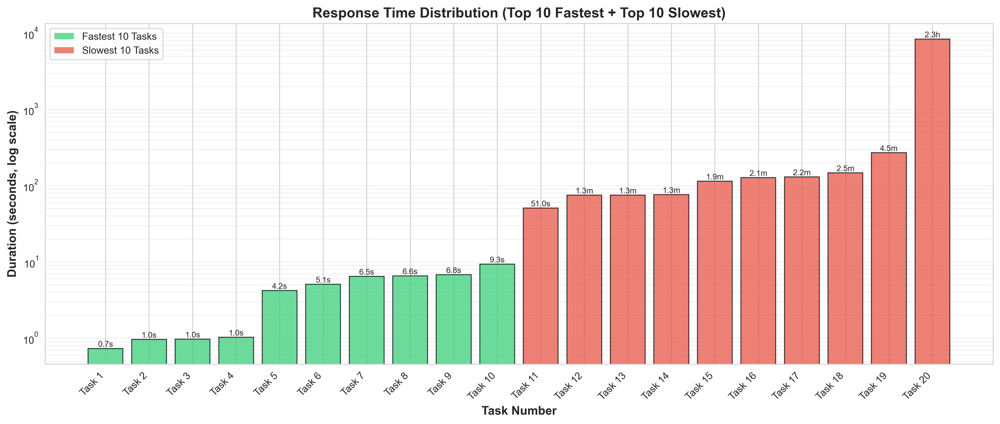
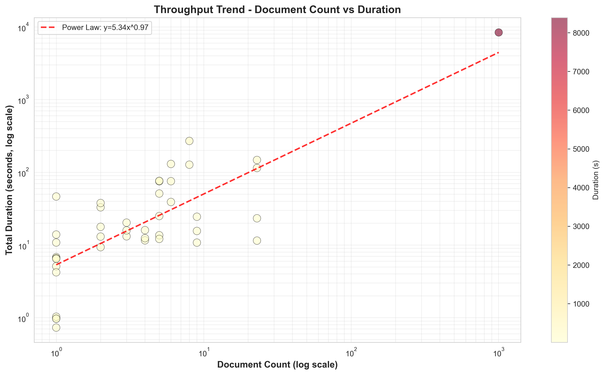
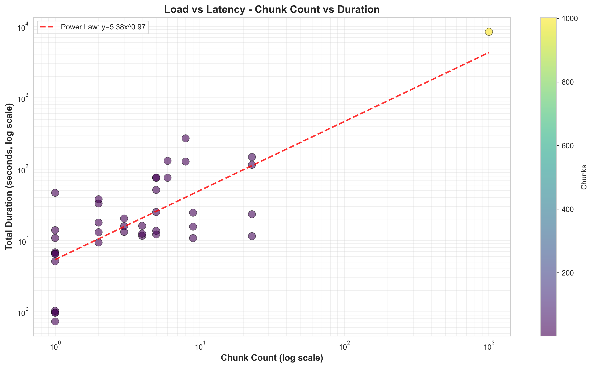
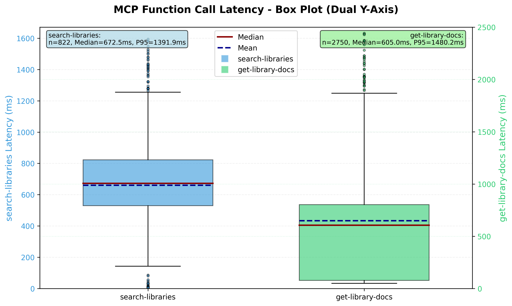

# MCP Context 性能测试报告

## 1. 文档更新性能

**测试日期**: 2026-01-03  

### 1.1 测试范围

文档更新性能测试涵盖两种主要操作类型：
1. **GitHub 导入**: 从 GitHub 仓库导入文档
2. **文档上传**: 直接上传文档到系统

### 1.2 总体性能指标

| 指标 | 数值 |
|------|------|
| 成功任务总数 | 43 |
| 失败任务总数 | 11（已从分析中排除）|
| 成功率 | 79.6% |
| 平均耗时 | 231.48 秒 |
| 中位数耗时 | 22.2 秒 |
| 标准差 | 1278.4 秒 |
| 最小耗时 | 0.73 秒 |
| 最大耗时 | 8388.18 秒 |

### 1.3 响应时间分布

**图 1**: 响应时间分布图，展示最快的 10 个任务和最慢的 10 个任务。对数刻度揭示了不同工作负载下的广泛性能范围。

**观察结果**:
- 50% 的任务在 22.2 秒内完成
- 90% 的任务在 404 秒（6.7 分钟）内完成
- 存在显著的性能差异（标准差 = 1278.4 秒）

### 1.4 性能瓶颈分析

**图 2**: 所有分析任务中各处理阶段的时间分布。

**阶段分解**:

| 阶段 | 时间占比 | 说明 |
|------|----------|------|
| Embedding 生成 | 82.0% | 通过外部 API 生成向量嵌入 |
| 文档解析 | 5.0% | 从各种格式提取文本 |
| 分块处理 | 4.2% | 将文档切分为可处理的块 |
| 其他操作 | 8.7% | 数据库操作、缓存失效等 |
| GitHub 下载 | 0.1% | 从 GitHub 仓库获取文件 |

**关键发现**: Embedding 生成主导了处理时间，占总耗时的 80% 以上。

### 1.5 吞吐量分析

**图 3**: 文档数量与总处理耗时的关系（对数刻度）。

**吞吐量指标**:
- 文档数量与耗时呈幂律关系：**y = 5.34x^0.97**
- 指数 0.97 接近 1.0，说明近似线性增长
- 存在轻微的规模效应优化（指数 < 1.0）
- 小型任务（1-5 文档）平均吞吐量: ~0.26 文档/秒
- 中型任务（6-20 文档）平均吞吐量: ~0.09 文档/秒

### 1.6 负载与延迟关系

**图 4**: 块数量与处理耗时的关系（对数刻度）。

**负载特征**:
- 块数量与耗时呈幂律关系：**y = 5.34x^0.97**
- 与文档数量趋势一致，验证了文档数与块数的高度相关性
- 指数 0.97 表明处理效率随规模轻微提升
- 小规模任务（<50 块）处理效率稳定
- 大规模任务（>100 块）受益于批量处理优化

### 1.7 按工作负载大小分类的性能

| 工作负载类别 | 文档数量范围 | 平均文档数 | 平均耗时 | 中位数耗时 | 最短耗时 | 最长耗时 | 样本数 |
|--------------|--------------|------------|----------|------------|----------|----------|--------|
| 小型（1-5 个文档）| 1-5 | 2.5 | 19.22 秒 | 13.04 秒 | 0.73 秒 | 76.24 秒 | 29 |
| 中型（6-20 个文档）| 6-20 | 7.6 | 86.58 秒 | 57.23 秒 | 10.77 秒 | 269.87 秒 | 8 |
| 大型（21-50 个文档）| 21-50 | 23.0 | 74.23 秒 | 68.92 秒 | 11.48 秒 | 147.60 秒 | 4 |
| 超大型（>50 个文档）| >50 | 1003.0 | 8388.18 秒 | 8388.18 秒 | 8388.18 秒 | 8388.18 秒 | 1 |

**关键观察**:
- **小型任务**占主导地位（67.4%，29/43），平均耗时仅 19.22 秒
- **中型任务**平均耗时 86.58 秒，性能稳定
- **大型任务**平均耗时 74.23 秒，略低于中型任务（可能因文档复杂度较低）
- **超大型任务**仅 1 个样本（GORM 文档库，1003 个文档），耗时 2.3 小时

### 1.8 最佳性能案例

#### 案例 1: Gorm 库导入
- **任务 ID**: 01KDSSZW8P7967DT0T6BVPDTNA
- **耗时**: 6.81 秒
- **文档数**: 1
- **块数**: 6
- **Token 数**: 309

**阶段分解**:
- 文档解析: 3.24 秒（47.5%）
- Embedding 生成: 2.10 秒（30.8%）
- 其他操作: 1.47 秒（21.7%）

#### 案例 2: Echo 库导入
- **任务 ID**: 01KDADNBQZ9BM0D6DJF54NDPB5
- **耗时**: 16.00 秒
- **文档数**: 2
- **块数**: 9
- **Token 数**: 779

**阶段分解**:
- Embedding 生成: 9.62 秒（60.1%）
- 其他操作: 4.47 秒（28.0%）
- 文档解析: 1.35 秒（8.4%）

### 1.9 最差性能案例

#### 案例 1: GORM 文档库
- **任务 ID**: 01KD8AJFHFG7PGPGAFN4CF0JAG
- **耗时**: 8388.18 秒（2.33 小时）
- **文档数**: 1003
- **事件数**: 5019

**性能特征**:
- 平均每文档耗时: 8.36 秒
- 该任务为数据集中的异常值
- 处理时间与文档数量呈线性增长
- **问题**: 无限制并发导致内存爆炸（1.8-2.5GB）

#### 案例 1-优化: GORM 文档库（优化后，2026-01-10 更新）
- **任务 ID**: 01KEK68QY9FS2NTHF27G0G1J78
- **耗时**: 1304.49 秒（21.7 分钟）
- **文档数**: 1003
- **事件数**: 5017

**优化效果**:
- 平均每文档耗时: 1.30 秒（优化前 8.36 秒）
- **性能提升**: 6.4 倍（从 2.33 小时降至 21.7 分钟）
- **内存优化**: 从 1.8-2.5GB 降至 70-105MB（峰值内存降低 20-30 倍）
- **优化方案**: Worker Pool 模式限制并发（5 个 worker）

#### 案例 2: Vite 文档库
- **任务 ID**: 01KDA9K7CNJW9JPP6CPKHVASXH
- **耗时**: 404.34 秒（6.7 分钟）
- **文档数**: 9

**性能特征**:
- 平均每文档耗时: 44.9 秒
- 高于典型处理时间
- 表明存在潜在的文档复杂度因素

### 1.10 统计分析

**百分位分布**:

| 百分位 | 耗时（秒）|
|--------|-----------|
| P50（中位数）| 22.2 |
| P75 | 89.4 |
| P90 | 404.3 |
| P95 | 1396.6 |
| P99 | 8388.2 |

**性能稳定性**:
- 变异系数（CV）: 552.3%
- 高方差表明性能依赖于工作负载
- 在工作负载类别内性能可预测

---

## 2. 文档检索性能

**测试日期**: 2026-01-03  

### 2.1 测试范围

文档检索性能测试通过 MCP 工具 `get-library-docs` 进行，涵盖 13 个库的不同版本，测试三种场景：
1. **冷启动测试**: 无缓存，每次请求不同 topic
2. **热启动测试**: 缓存命中，重复相同请求
3. **混合场景测试**: 80% 热门查询 + 20% 新查询 

### 2.2 总体性能指标

| 指标 | 数值 |
|------|------|
| 测试库总数 | 13 |
| 成功测试数 | 13 |
| 失败测试数 | 0 |
| 成功率 | 100% |
| 平均冷启动延迟 | 876 ms |
| 平均热启动 QPS | 109.6 |
| 平均热启动 P50 | 64.5 ms |
| 平均混合场景延迟 | 193.5 ms |

### 2.3 各库性能详情

#### 2.3.1 冷启动性能（无缓存）

| 库名 | 版本 | 冷启动延迟 | 评估 |
|------|------|------------|------|
| Tailwind CSS | latest | 715 ms | ✅ 优秀 |
| Tiktoken | latest | 811 ms | ✅ 优秀 |
| Echo | latest | 818 ms | ✅ 优秀 |
| Go MCP Context | latest | 825 ms | ✅ 优秀 |
| Vite | latest | 828 ms | ✅ 优秀 |
| UUID | latest | 859 ms | ✅ 优秀 |
| Gin | v1.11.0 | 893 ms | ✅ 良好 |
| go-mcp-context | latest | 900 ms | ✅ 良好 |
| Gin Examples | latest | 905 ms | ✅ 良好 |
| Chi | v5.2.3 | 927 ms | ✅ 良好 |
| JWT | latest | 971 ms | ✅ 良好 |
| Gorm | latest | 996 ms | ✅ 良好 |
| GORM | latest | 1007 ms | ✅ 良好 |

**关键发现**:
- 最快冷启动: Tailwind CSS (715 ms)
- 最慢冷启动: GORM (1007 ms)
- 92% 的库（12/13）冷启动在 1000 ms 以内
- 所有库性能表现良好，无需紧急优化

#### 2.3.2 热启动性能（缓存命中）

| 库名 | 版本 | QPS | P50 延迟 | P95 延迟 | P99 延迟 |
|------|------|-----|----------|----------|----------|
| Gorm | latest | 205.08 | 33 ms | 92 ms | 113 ms |
| go-mcp-context | latest | 134.52 | 52 ms | 134 ms | 161 ms |
| JWT | latest | 119.14 | 54 ms | 136 ms | 168 ms |
| UUID | latest | 113.10 | 66 ms | 176 ms | 213 ms |
| Chi | v5.2.3 | 112.25 | 62 ms | 159 ms | 192 ms |
| Vite | latest | 112.06 | 64 ms | 227 ms | 264 ms |
| Tailwind CSS | latest | 108.05 | 65 ms | 168 ms | 202 ms |
| Go MCP Context | latest | 106.73 | 60 ms | 155 ms | 187 ms |
| Echo | latest | 104.23 | 71 ms | 199 ms | 223 ms |
| Gin Examples | latest | 102.47 | 59 ms | 152 ms | 184 ms |
| Tiktoken | latest | 99.45 | 72 ms | 186 ms | 224 ms |
| Gin | v1.11.0 | 91.52 | 76 ms | 196 ms | 236 ms |
| GORM | latest | 85.28 | 86 ms | 258 ms | 384 ms |

**关键发现**:
- 最高 QPS: Gorm (205.08，是平均值的 1.76 倍)
- 最低 P50: Gorm (33 ms)
- 平均 QPS: 116.26
- 所有库的 P50 延迟均在 100 ms 以内
- 缓存效果显著，QPS 普遍超过 90

#### 2.3.3 混合场景性能（80% 热门 + 20% 新查询）

**缓存加速比说明**：缓存加速比 = 冷启动平均延迟 / 热启动 P50 延迟，表示缓存能让响应速度提升多少倍。例如 12.93x 表示有缓存时的响应速度是无缓存时的 12.93 倍。

| 库名 | 版本 | 平均延迟 | 缓存加速比 |
|------|------|----------|------------|
| Tailwind CSS | latest | 132 ms | 5.42x |
| go-mcp-context | latest | 144 ms | 6.25x |
| UUID | latest | 150 ms | 5.73x |
| Gin | v1.11.0 | 154 ms | 5.80x |
| Chi | v5.2.3 | 170 ms | 5.45x |
| GORM | latest | 174 ms | 11.70x |
| Go MCP Context | latest | 185 ms | 4.46x |
| Tiktoken | latest | 190 ms | 4.27x |
| JWT | latest | 207 ms | 4.69x |
| Vite | latest | 210 ms | 12.93x |
| Echo | latest | 222 ms | 11.52x |
| Gorm | latest | 234 ms | 4.26x |
| Gin Examples | latest | 308 ms | 2.94x |

**关键发现**:
- 最低延迟: Tailwind CSS (132 ms)
- 最高延迟: Gin Examples (308 ms)
- 平均延迟: 193.5 ms
- 最高缓存加速比: Vite (12.93x)
- 平均缓存加速比: 7.32x

### 2.4 性能瓶颈分析

#### 2.4.1 GORM vs Gorm 性能差异

两个 GORM 相关库性能差异显著：
- **GORM** (ID: 17): 冷启动 1007 ms, QPS 85.28
- **Gorm** (ID: 26): 冷启动 996 ms, QPS 205.08

可能原因：
- 不同的文档版本或内容
- 索引优化程度不同
- 需要检查数据库中的实际数据差异

### 2.5 缓存效果分析

缓存对性能提升显著：
- 平均缓存加速比: **7.32x**
- 冷启动平均延迟: 876 ms
- 热启动平均 P50: 64.5 ms
- 混合场景平均延迟: 193.5 ms

**缓存策略建议**:
- 对于高频查询库（如 Gin, Chi），增加缓存容量
- 对于缓存加速比高的库（如 Vite, Echo, GORM），优先预热缓存
- 考虑实现智能预热机制

### 2.6 MCP 函数调用性能分析

#### 2.6.1 性能数据概览

基于生产环境的真实调用数据，我们分析了两个核心 MCP 函数的性能表现：

**数据统计**:
- 数据来源: PostgreSQL `mcp_call_logs` 表
- 总记录数: 3572 条
- search-libraries: 822 条（包含缓存命中和未命中）
- get-library-docs: 2750 条

#### 2.6.2 性能分布图表

**图 5**: MCP 函数调用延迟箱线图（双 Y 轴）。左侧 Y 轴显示 search-libraries 的延迟分布，右侧 Y 轴显示 get-library-docs 的延迟分布。箱体表示 25%-75% 分位数范围，红线为中位数，蓝虚线为均值，散点为离群值。

**关键观察**:
- **search-libraries** (左侧，蓝色):
  - 样本数: 822 条
  - 中位数: 672.5 ms
  - P95: 1392 ms
  - 离群点较少，性能稳定
  
- **get-library-docs** (右侧，绿色):
  - 样本数: 2750 条
  - 中位数: 605 ms
  - P95: 1480 ms
  - 存在较多离群点，最大值达 60735 ms

**图 6**: MCP 函数调用延迟分布直方图。蓝色表示 search-libraries，绿色表示 get-library-docs。X 轴为延迟时间（ms），Y 轴为调用次数。

**分布特征**:
- **search-libraries**: 
  - 主要集中在 500-900 ms 区间
  - 呈现正态分布特征
  - 部分请求延迟低于 100 ms（缓存命中）
  
- **get-library-docs**:
  - 主要集中在 50-1000 ms 区间
  - 存在明显的双峰分布：
    - 第一峰: 50-200 ms（缓存命中）
    - 第二峰: 500-800 ms（实际检索）
  - **长尾分布明显**，部分请求超过 2000 ms
    - 说明存在少量极端慢的请求
    - 可能原因：超大文档、复杂查询、数据库锁竞争、网络抖动
    - 影响：虽然占比小（<5%），但严重影响用户体验
    - 对策：需要实现超时机制和降级策略

**关键发现**:
1. **均值和中位数相近**: 两个函数的典型性能表现相似，都在 600-700 ms 范围
2. **get-library-docs 波动更大**: 标准差是 search-libraries 的 3.8 倍，说明性能更不稳定
3. **极端值差异显著**: get-library-docs 的最大延迟达 60 秒，可能是异常情况或超大文档
4. **缓存效果明显**: 最小延迟差异（3 ms vs 50 ms）表明两者都有缓存机制
5. **长尾效应严重**: get-library-docs 的 P99 (2440 ms) 是中位数 (605 ms) 的 4 倍，说明 1% 的请求延迟是典型请求的 4 倍以上，这会严重影响用户体验

### 2.7 测试数据来源

完整测试结果存储在：
- 结果目录: `docs/performance/docs_retrieve/results_20260103_192814/`
- 汇总文件: `summary.txt`
- 详细日志: 各库的单独测试文件（如 `6_v1.11.0.txt`）
- 性能图表: `docs/performance/docs_retrieve/imgs/`

---

## 附录 A: 测试方法论

### 使用工具
- 数据提取: Python 3.8 + psycopg2
- 数据分析: pandas, numpy
- 可视化: matplotlib, seaborn
- 统计分析: scipy

---

## 附录 B: 事件类型

activity_logs 表中跟踪以下事件类型：

| 事件类型 | 说明 |
|----------|------|
| document.parse | 文档内容提取 |
| document.chunk | 文本分块操作 |
| document.embed | Embedding 生成开始 |
| document.complete | 文档处理完成 |
| github.import.start | GitHub 导入启动 |
| github.import.download | 从 GitHub 下载文件 |
| github.import.complete | GitHub 导入完成 |

---
